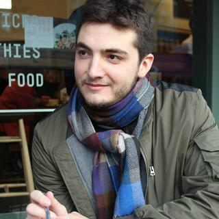

<!-- I am a Data Scientist at [HarperCollins Publishers](https://www.harpercollins.co.uk) in London where I do research and development. I graduated with an MSc in Advanced Computing from Imperial College London, and a *Diplôme d'Ingénieur* in Applied Mathematics and CS from Ensimag (Grenoble). -->
I am a Data Scientist and Machine Learning engineer. I am currently finishing a research internship at [Speechmatics (Cantab Research Ltd.)](https://www.speechmatics.com) where I am working on improving the company's recurrent neural network language models. Prior to this, I was a Data Scientist at [HarperCollins Publishers](https://www.harpercollins.co.uk) in London. I graduated with an MSc in Advanced Computing from Imperial College London, and a *Diplôme d'Ingénieur* in Applied Mathematics and CS from Ensimag (Grenoble).

See my [Curriculum Vitae](./Bahri_CV.pdf) or my short [Resume](./Bahri_resume.pdf).

## Current research interests

Besides what I do at work, I am interested in a variety of topics in Machine Learning, notably in statistical learning and optimisation.

* Non-euclidean geometry in Machine Learning (manifold learning, Riemannian optimisation)
* Approximate inference in probabilistic graphical models
* Representation learning and component analysis
* Tensor methods, sparse coding, compressed sensing (see my MSc thesis)
* Social network analysis, more precisely influence propagation

My preferred applications are in data science, computer vision, and medical research.

## News

* July 2017: I have been selected as a semi-finalist for the Data Science fellowship by [The Data Incubator](https://www.thedataincubator.com).
* July 2017: My paper "Robust Kronecker-Decomposable Component Analysis for Low-Rank Modeling" has been accepted at [ICCV 2017](http://iccv2017.thecvf.com)!
<!-- * March 2017: Our paper "Robust Low-rank Tensor Modelling Using Tucker and CP Decomposition" has been accepted at EUSIPCO 2017! -->

## Projects

Below are some select projects

### MSc thesis at Imperial College London
*Robust low-rank modelling on tensors: new algorithms and extensive comparisons*

Supervisor: [Dr Stefanos Zafeiriou](https://wp.doc.ic.ac.uk/szafeiri/)

* [Thesis in PDF](https://github.com/mbahri/msc_thesis/raw/master/MSc_Thesis_final.pdf)
* [Slides](https://github.com/mbahri/msc_thesis/raw/master/Slides_thesis.pdf)

[ICCV paper (arxiv preprint)](https://arxiv.org/abs/1703.07886) camera-ready version in preparation.
One paper co-authored for EUSIPCO 2017.

**Awarded the Winton Capital Computing MSc Project Prize** (best MSc thesis in Computer Science, 1/188 students)

### Robust non-negative dictionary learning
A MATLAB implementation of the algorithm from

> Robust Non-Negative Dictionary Learning Qihe Pan, Deguang Kong, Chris Ding and Bin Luo In Proceedings of the 28th conference of the AAAI - 2014

that I wrote for the paper I have submitted to ICCV 2017.

* [Code](https://github.com/mbahri/rnndl)

### A data science competition
I took part in the [Pump it Up](https://www.drivendata.org/competitions/7/) competition hosted by DrivenData in May 2016 as part of the recruitment process of a London startup. With about two days of quick hacking at the time, I am currently in the top 7%.

* [Code (R)](https://github.com/mbahri/pumpitup)

### Bayesian optimisation for training RBMs

The purpose of this coursework was to experiment with Restricted Boltzman Machines (RBMs). I took it a step further and used Bayesian optimisation with [SMAC](http://www.cs.ubc.ca/labs/beta/Projects/SMAC/) to find good hyperparameters, and did a bit of statistical analysis to validate some hypothesis and findings.

* [Report](https://github.com/mbahri/rbm_bayesian_optimisation/raw/master/Report/DNSDL_cw2.pdf)
* [Code](https://github.com/mbahri/rbm_bayesian_optimisation)

<!-- ### Probabilistic inference of over-diagnosis
TODO -->

## Publications
* One *anonymous submission* to [CVPR 2017](http://cvpr2017.thecvf.com) with S. Zafeiriou and Y. Panagakis
* Work in progress for a journal version (PAMI, JMLR...)

## Author

Mehdi Bahri ([GitHub](http://github.com/mbahri)/[LinkedIn](https://uk.linkedin.com/in/mehdibahri/en)/[Quora](https://www.quora.com/profile/Mehdi-Bahri)).

Contact: mehdi [dot] b [dot] tn [at] gmail [dot] com

<!-- ### License -->

<!-- [MIT License](http://chibicode.mit-license.org/) -->

<!-- <a href="https://github.com/chibicode/solo" class="github-corner"><svg width="80" height="80" viewBox="0 0 250 250" style="fill:#151513; color:#fff; position: absolute; top: 0; border: 0; right: 0;"><path d="M0,0 L115,115 L130,115 L142,142 L250,250 L250,0 Z"></path><path d="M128.3,109.0 C113.8,99.7 119.0,89.6 119.0,89.6 C122.0,82.7 120.5,78.6 120.5,78.6 C119.2,72.0 123.4,76.3 123.4,76.3 C127.3,80.9 125.5,87.3 125.5,87.3 C122.9,97.6 130.6,101.9 134.4,103.2" fill="currentColor" style="transform-origin: 130px 106px;" class="octo-arm"></path><path d="M115.0,115.0 C114.9,115.1 118.7,116.5 119.8,115.4 L133.7,101.6 C136.9,99.2 139.9,98.4 142.2,98.6 C133.8,88.0 127.5,74.4 143.8,58.0 C148.5,53.4 154.0,51.2 159.7,51.0 C160.3,49.4 163.2,43.6 171.4,40.1 C171.4,40.1 176.1,42.5 178.8,56.2 C183.1,58.6 187.2,61.8 190.9,65.4 C194.5,69.0 197.7,73.2 200.1,77.6 C213.8,80.2 216.3,84.9 216.3,84.9 C212.7,93.1 206.9,96.0 205.4,96.6 C205.1,102.4 203.0,107.8 198.3,112.5 C181.9,128.9 168.3,122.5 157.7,114.1 C157.9,116.9 156.7,120.9 152.7,124.9 L141.0,136.5 C139.8,137.7 141.6,141.9 141.8,141.8 Z" fill="currentColor" class="octo-body"></path></svg></a> -->
